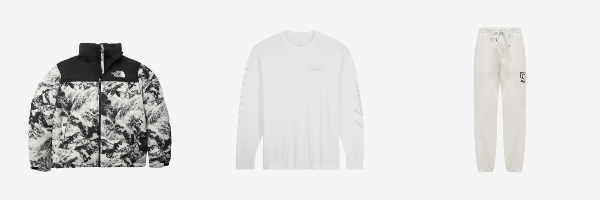

# Stable Diffusion Finetune to Generate Fashion Items

В данном проекте были проведены экперименты по дообучению и файнтюнингу моделей Stable Diffusion в целью генерации реалистичных изображений модных экземпляров одежды по текстовому описанию.

## Dataset

В качестве датасета модной одежды был использован [KREAM Product Blip Captions Dataset](https://huggingface.co/datasets/hahminlew/kream-product-blip-captions). <br>
Этот набора данных  был собран с сайта  [KREAM](https://kream.co.kr/), одного из лучших онлайн-реселлеров на рынке Кореи. <br>
Этот набор данных состоит из пар ключей "изображение" и "текст" на английском языке. Формат "текста" : "категория (например, верхняя одежда), оригинальное название продукта (например, The North Face 1996 Eco Nuptse Jacket Black), и blip caption (например, a photography of the north face black down jacket)".<br>



## Dependencies for Finetuning

- python >= 3.10
- xFormers
- PyTorch == 2.0.1
- Hugging Face 🤗: diffusers, transformers, datasets

```
pip install git+https://github.com/huggingface/diffusers
```

```
pip instal -r ./finetune/requirements.txt
```

## Finetuning Stable Diffusion Instructions

Для дообучения предобученных моделей были использованы скрипты из [Hugging Face Diffusers Text-to-Image Examples](https://github.com/huggingface/diffusers/tree/main/examples/text_to_image)<br>
Все скрипты для дообучения можно найти в папке [finetune](./finetune)

**Были проведены экcперименты по дообучении следующих моделей:**

-  Stable Diffusion v 1-4 Finetuned <br>
    Запуск скрипта для дообучения:

```
./finetune/run_sd_1_4.sh
```

-  Stable Diffusion v 1-4 LoRA <br>
   Запуск скрипта для дообучения:

```
./finetune/run_sd_lora_1_4.sh
```

-  Stable Diffusion v 2-1 Finetuned <br>
   Запуск скрипта для дообучения:

```
./finetune/run_sd_2_1.sh
```

-  Stable Diffusion v 2-1 LoRA <br>
   Запуск скрипта для дообучения:

```
./finetune/run_sd_lora_2_1.sh
```

-  Stable Diffusion XL v 1.0 LoRA <br>
   Запуск скрипта для дообучения:

```
./finetune/run_sdxl_lora.sh
```

**Убедитесь, что у вас есть учетная запись Hugging Face и wandb. Вам следует создать каталог и персональные токены для Hugging Face. Также, пожалуйста, проверьте свои персональные API-ключи для wandb.**

## Сравнение результатов дообучения


## Inference и сравнение результатов моделей

Примеры инференса дообученных моделей и сравнение результатов можно найти в jupyter ноутбуках в папке [Notebooks_inference_examples](./Notebooks_inference_examples) <br>
Изображения с результатами генерации модных экземпляров с использованием разных моделей с одни м тем же промтом для сравнительного анализа сохранены в папке [images_output](./images_output) <br>

Наилучший результат по визуальным качествам получен с помощью модели *Stable Diffusion XL v 1.0 LoRA* (однако требуется более 10GB GPU RAM для инференса)
Второй по качеству результат показала модель *Stable Diffusion v 1-4 Finetuned*  

## Gradio WebUI

Для удобства и простоты использования модели генерации изображений модных экземпляров одежды по текстовому описанию предлагается создание Web UI на базе Gradio. <br>

Для запуска веб приложения c использованием модели *Stable Diffusion v 1-4 Finetuned*  запустите скрипт:

```
python ./Gradio_Web_UI/app_gradio_sd_1_4.py
```

Gradio Web UI  *Stable Diffusion v 1-4 Finetuned* из Google Colab используйте [Colab Notebook](./Gradio_Web_UI/gradio_sd_fashion_1_4.ipynb)


Для запуска веб приложения c использованием модели * Stable Diffusion XL v 1.0 LoRA*  запустите скрипт:

```
python ./Gradio_Web_UI/app_gradio_sd_xl_lora.py
```

Gradio Web UI  * Stable Diffusion XL v 1.0 LoRA* из Google Colab используйте [Colab Notebook](./Gradio_Web_UI/gradio_SDXL_LORA.ipynb)

## Полезные ссылки

- [BLIP image captioning](https://github.com/salesforce/BLIP) and [BLIP Hugging Face Demo](https://huggingface.co/Salesforce/blip-image-captioning-large)
- [Hugging Face Diffusers Text-to-Image Examples](https://github.com/huggingface/diffusers/tree/main/examples/text_to_image)
- [Hugging Face Dataset Creation Tutorial](https://huggingface.co/docs/datasets/create_dataset)
- [LoRA: Low-rank Adaptation for Fast Text-to-Image Diffusion Fine-tuning](https://github.com/cloneofsimo/lora)
- [Using LoRA for Efficient Stable Diffusion Fine-Tuning](https://huggingface.co/blog/lora)
